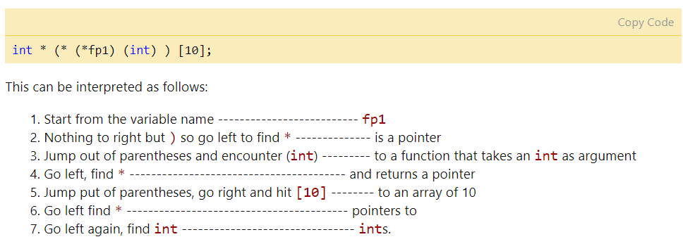

# C++ primer2/3/4 章
## 1 第二章
### 1.1 类型转换和整形提升
#### 1.1.0 数据存储
执行程序时，总内存分成文本段，包含未初始化全局／初始化的全局／堆／栈段；
数值分配给变量时，首先转换成二进制，存储到存储器中;

字符ASCII

整数：如果是signed,　最高有效位为符号位，正０负１;
负整数：取反+1；
检查是否MSB
~~~C
bits = sizeof(T)* 8
msb = 1 <<(bits-1)
m & msb ? "m是负数":"m是非负数";
~~~

float浮点数(32位)：指数分配８位,有效小数位23,1MSB

eg: 10.75 -> 1010.11 -> 1.01011 * 2^3 -> 指数偏置2^7-1=127, 加上当前偏置3 = 130 = 10000010 -> 1 1000010 01011 0...

double浮点数(64位)：指数分配11位,有效小数位52,1MSB

#### 1.1.1 隐式类型转换
整形类型提升: 

在表达式计算时要在cpu器件内执行,CPU内整型运算器(ALU)的操作数的字节长度 ，一般就是int的字节长度，同时也是CPU的通用寄存器的长度。
所以表达式中小于int先转换为int再执行运算;
signed:按照数据类型符号位提升, 高位直接补充符号位;unsigned 高位直接补0
1) char/short转换为int,float转换为double 
2) 其中一个操作数类型为double/long/unsigned,另一个操作数也转换为double/long/unsigned
3) 否则两操作数都转为int
4) 如果int可以完整表示源类型的所有值，那么该源类型的值就转换为int，否则转换为unsigned int,long,unsigned long。

数组退化为指针
~~~c
void fun_ptr(int arr[]) //传入指针,数组的头部地址按照值传递,拷贝给fun函数新创建的指针变量;
{
    sizeof(arr); //4
}
void fun_ref(int (&arr)[]) //传入引用,阻止拷贝发生,传和形参一样大小数组
{
    sizeof(arr); //40
}

template<int T>
void fun_tem(int (&arr)[T])
{
    for(auto a:arr){

    }
}

int main(){
    int a[10];
    fun_ptr(a);
    fun_ref(&a);
    fun_tem();
}

~~~
函数转换为函数指针
1) 指向可执行代码的开头
2) 不分配内存
3) 函数名可以用来获取函数地址
  

~~~c++

void fun(int a)
{
    printf("Value of a is %d\n", a);
}
  
int main()
{
    // fun_ptr is a pointer to function fun() 
    void (*fun_ptr)(int) = fun; 
    void (*fun_ptr)(int) = &fun;
    /* The above line is equivalent of following two
       void (*fun_ptr)(int);
       fun_ptr = &fun; 
    */
    // Invoking fun() using fun_ptr
    (*fun_ptr)(10);
    fun_ptr(10);  
    return 0;
}

// p是一个指针,指向函数,入参char 返回 int
int (*p)(char);
// 指向函数,入参2float 返回指针指向指针指向char
char ** (*p)(float, float);
// an array of 5 pointers to functions that receive two const pointers to chars and return a void pointer
void * (*a[5])(char * const, char * const);
~~~
bool

数值转换
1) double，float 四舍五入,保留小数位数。
2) std::to_string 数字转换成string。
3) std::stoi/stol/stoll 函数，字符串转换成整数，但不会四舍五入。
4) ascii与整数\十六进制\字符串相互转换 参考: https://www.cnblogs.com/ike_li/p/8340725.html

数据指针到void指针

1) 任何类型的指针都可以直接赋值给它，无需进行强制类型转换。
2) void型指针解引用须做类型指定 GNU指定“void”的算法操作与“char”一致，因此上述写法在GNU则可以编译
3) 任何类型的指针都可以传入 memcpy 和 memset 中，这也真实地体现了内存操作函数的意义
~~~c
void * memcpy(void *dest, const void *src, size_t len);
void * memset(void * buffer, int c, size_t num);
~~~ 

#### 1.1.2 const转换
底层: const wolatle转换,只能添加不能减少

#### 1.1.3 
const_cast : 常量引用\指针->非常量
static_cast : 基类和派生类转换
dynamic_cast : 
reinterpret_cast : 任意指针之间的转换

### 1.2 结构体对齐/内存对齐
数据对象内存可被２^n整除，CPU高效加载存入寄存器，直接一次读取4/8字节；
1) 需要X字节的原始数据类型，地址必须是X的倍数, 所以struct的起始地址决于其成员变量中的数据类型的sizeof()最大值作为对齐条件;
2) 编译是对未使用内存空间padding,确保字节对齐;
3) char1,short2,int/float4,double 4/8,pointer4/8
4) 
补充: nested pack
~~~c++
#pragma pack (4)                // 4-byte alignment
         struct nested {
           int  x;
           char y;
           int  z;
         };

         #pragma pack(1)           // 1-byte alignment
         struct packedcxx{
            char   a;
            short  b;
            struct nested  s1;     // 4-byte alignment
         };
~~~

字节序:大端小端
运算符优先级
括号,单目运算(++ -- * */% +-),移位,关系比较,等于不等,位异或, 三分,逻辑与或,&& ||,条件高于赋值,逗号
逗号,从左往右,值为最后一个表达式
(2<=x<=3)恒等1
右移前考虑先转换成usigned

补码源码,设计原理

### 1.3 const
1) 与define区别：只给出对应内存地址，所以多次调用只有一个copy，可以进行安全检查
2) 作用域，非const变量默认为extern。要使const变量能够在其他文件中访问，必须在文件中显式地指定它为extern。
3) 指针与const:向左结合　const*ｐ 底层const 指针p指向常量　
*const p　顶层const 常量指针指向p

4) 允许把非const对象的地址赋给指向const对象的指针。
~~~c++
//  same type - constant integers
const int n=5;
int const m=10;

// pointers to const ints
const int *p; 
int const *q;

int * const r= &n; //A const pointer to an int
const int * const p=&n //A const pointer to a const int

// 向左结合
char ** p1; // pointer to pointer to char
const char **p2; // pointer to pointer to const char
char * const * p3; // pointer to const pointer to char
const char * const * p4; // pointer to const pointer to const char
char ** const p5; // const pointer to pointer to char
const char ** const p6; // const pointer to pointer to const char
char * const * const p7; // const pointer to const pointer to char
const char * const * const p8; // const pointer to const to const char
~~~
#### 5) 函数

在参数指针里添加 
~~~c
// src 指向内容不可变
void StringCopy(char *dst, const char *src);
// a为引用, 引用传递可能被改变,需要加上const修饰,表示 产生A类型的临时对象a,且a不能被修改
void func(const A &a)
// 没有必要, 内部数据从类型参数不需要构造析构,复制也很快,而且int值传递大小比指针小,值传递即可
void func(const int &x)
~~~
#### 6) 类
1) 类中不会修改数据成员的函数需要声明成const;
2) const成员变量,需要通过构造函数初始化列表/static/外部/直接定义初始化,且只能访问const成员函数;
3) 非const对象可以访问任意的成员函数,包括const成员函数。
~~~c++
// ExampleCst
class ExampleCst
{
private:
    int c[];
public:
    ExampleCst(int i);
    const int val;
    // c++11 支持直接初始化 const int val = 10;
    void Take(int num) const;
    int Add(int num);
    int Add(int num) const; //val 默认调用
    int GetCnt() const;
};
// main
// 构造函数初始化列表初始化
ExampleCst::ExampleCst(int i):val(i) {}
// 或者 const int ExampleCst::val = 10;
// 或者 static const int val; 
int ExampleCst::Add(int num) const {
    Take(num);
}
int ExampleCst::Add(int num) {
    Take(num);
}
void ExampleCst::Tale(int num) const {
}
int ExampleCst::GetCnt(int num) const {
    Take(1);
    Add(); //error,需要加上const修饰
    return val;
}
~~~

#### 7) volatile

#### 8)

### 1.4 static
使用场景:函数\类中的静态变量,静态类的成员函数，贯穿程序的生命周期
#### 1)静态变量
函数:　程序的生命周期内分配，多次调用只分配1次
类:　在单独的静态存储中分配空间，由对象共享，不同对象，共享一个静态变量，所以不能用构造函数初始化静态变量．
#### 2)静态成员
类的静态对象：声明为static的对象，程序执行后再调用析构函数，否则非static对象将在作用域结束后可能越权调用析构函数；
类的静态函数：不依赖于对象，可以使用．调用，推荐使用类名::调用＇

#### 3)和const对比
const常量超出其作用域之后其空间会被释放，后者函数执行后不会释放空间；
const不能在类定义处初始化，static不能在类内部初始化
const常量是对于对象的生命周期，对类是可变的,　防止成员函数修改对象内容，后者是作为类的全局函数，没有this指针；
想建立在整个类中都恒定的常量，需要用static const或枚举常量；

参考：https://blog.csdn.net/tobefxz/article/details/14109697

typedef
~~~c++
// both p and q become pointers
typedef char * PCHAR;
PCHAR p,q;

typedef char * a;  // a is a pointer to a char

typedef a b();     // b is a function that returns
                   // a pointer to a char

typedef b *c;      // c is a pointer to a function
                   // that returns a pointer to a char

typedef c d();     // d is a function returning
                   // a pointer to a function
                   // that returns a pointer to a char

typedef d *e;      // e is a pointer to a function 
                   // returning  a pointer to a 
                   // function that returns a 
                   // pointer to a char

e var[10];         // var is an array of 10 pointers to 
                   // functions returning pointers to 
                   // functions returning pointers to chars.
~~~

constexpr
decltype